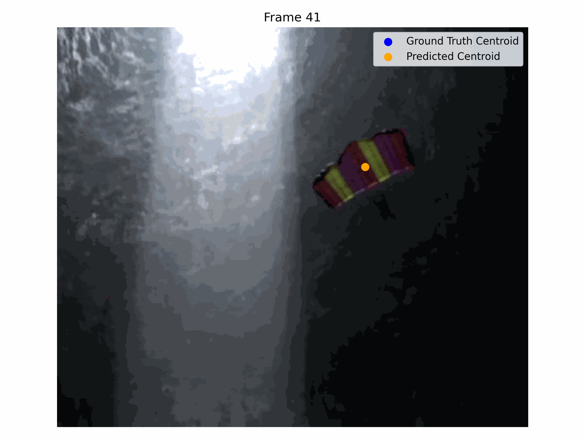

# CMP9135M Computer Vision – Assignment 2  
## Feature Extraction and Object Tracking using Kalman Filters

---

## Project Overview

This project focuses on two main computer vision tasks:

1. **Feature Extraction**
2. **Object Tracking using Kalman Filters**

The dataset contains a sequence of **51 RGB images** and corresponding **ground truth (GT) masks** of a parachute descending through the scene. The goal is to analyse the parachute’s shape and texture features and then track its motion (translation and rotation) over time.

---

## Objectives

- Extract meaningful **shape features** from segmentation masks
- Compute **texture features (HoG)** from images
- Analyse feature variation across frames
- Implement **Kalman Filters from scratch**
- Predict the parachute’s **position and orientation**
- Evaluate tracking performance using error metrics


## Installation

Create and activate virtual environment:

```powershell
python -m venv .venv
.venv\Scripts\activate
````

Install dependencies:

```powershell
pip install -r requirements.txt
```

---

##  How to Run

### 1. Feature Extraction

```powershell
python src/main_feature_extraction.py
```

This will:

* Load images and masks
* Compute shape features
* Compute HoG features
* Generate plots and CSV files

---

### 2. Object Tracking

```powershell
python src/main_tracking.py
```

This will:

* Train Kalman filters on frames 0–40
* Predict frames 41–50
* Compute tracking errors
* Generate plots, tables, and GIF visualization


---

##  Feature Extraction

### Shape Features

Extracted from segmentation masks:

* **Solidity** → shape compactness
* **Non-compactness** → boundary irregularity
* **Circularity** → closeness to circular shape
* **Eccentricity** → elongation
* **Orientation** → object rotation angle

---

### Texture Features (HoG)

Histogram of Oriented Gradients (HoG) captures edge directions.

Computed at:

* 0°
* 45°
* 90°
* 135°

---

## Feature Outputs

Saved in:

```
results/tables/
```

* `shape_features.csv`
* `hog_features.csv`
* `feature_summary.csv`

Plots saved in:

```
results/plots/
```

* Shape feature plots
* HoG plots
* Normalized feature comparison

---

## Object Tracking

### Translation Tracking

Tracks:

* Centroid (x, y)
* Velocity (vx, vy)

Uses **constant velocity Kalman filter**

---

### Rotation Tracking

Tracks:

* Orientation angle (θ)
* Angular velocity (ω)

Orientation derived using mask-based shape properties.

---

## Parameter Tuning

Best parameters found:

```
process_noise = 0.1
measurement_noise = 1.0
```

Saved in:

```
results/tables/kalman_parameter_search.csv
```

---

## Tracking Performance

* **Mean Translation Error:** ~2.09 pixels
* **RMSE Translation Error:** ~2.56 pixels
* **Mean Rotation Error:** ~1.2 degrees

Errors increase in later frames due to **prediction-only phase (no updates)**.

---

## Tracking Outputs

Saved in:

```
results/tables/
```

* `tracking_errors.csv`
* `tracking_summary.csv`

Plots:

* Translation error vs frames
* Rotation error vs frames
* Predicted vs GT centroid (X & Y)

---

## Visualization

Overlay images:

```
results/plots/tracking_overlay/
```

GIF:

```
results/plots/tracking_overlay.gif
```

Shows:

* Ground truth centroid (blue)
* Predicted centroid (orange)


## Conclusion

This project demonstrates:

* Effective feature extraction
* Reliable object tracking
* Strong performance with low error
* Clear visual and numerical evaluation

